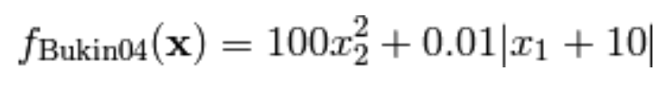
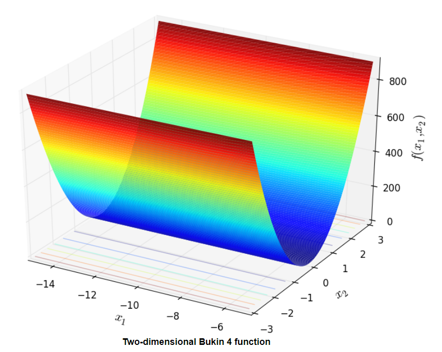

# Genetic Algorithms for Function Minimization

## Project Info

### Requirements:

- Python >= 3.8
- Numpy package

## Implementation

This implementation was made by [JahKnows](https://datascience.stackexchange.com/questions/30026/find-the-minimum-value-of-x2y2-with-genetic-algorithm).

Just made some changes to accept values from a cvs file and the fitness function used to be minimized was Bukin 04 as shown on the figure.

### Run the Script

`python script.py`

### Files

`script.py` is the modified file, it will minimize the function only using the values that are in the file `values.csv`

`example.py` is going to minimize the function testing values from -100 to 100
